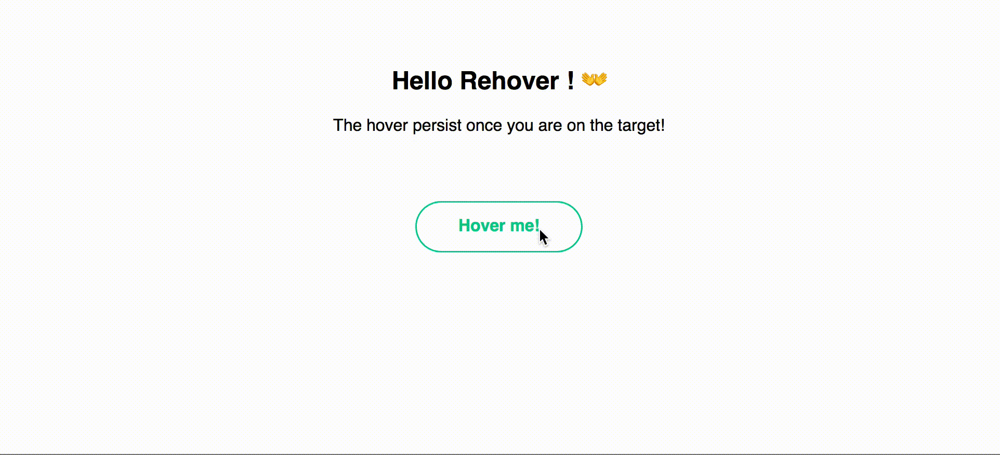

# Rehover 👐

#### React hovering on two elements made simpler!

[](https://travis-ci.org/PaulRosset/rehover)
[](https://badge.fury.io/js/rehover)



## Install

```sh
yarn add rehover
```

## Usage

> React v16.0 required, [rendering arrays in render method.](https://reactjs.org/blog/2017/09/26/react-v16.0.html)

```js
import React from "react";
import Rehover from "rehover";
```

```jsx
<Rehover delay={150}>
  <button source>Hover me!</button>
  <div destination>
    <a href="#">A</a>
    <a href="#">B</a>
    <a href="#">C</a>
  </div>
</Rehover>
```

## API

* Delay: Number `delay`

  * To let you the time to go to the target.

* States: Function `states`
  * Function with `isOpen`, `isOntarget` and `isOnSource` as parameter `Boolean`, to let you construct animation for example.

> If you want to pass a **_React Component_** as a source or destination, make sure that they got a onMouseEnter props and a onMouseLeave props at their root.

## Live demo/Sandbox

[](https://codesandbox.io/s/0o78oxx3w0)

## License

MIT Paul Rosset
